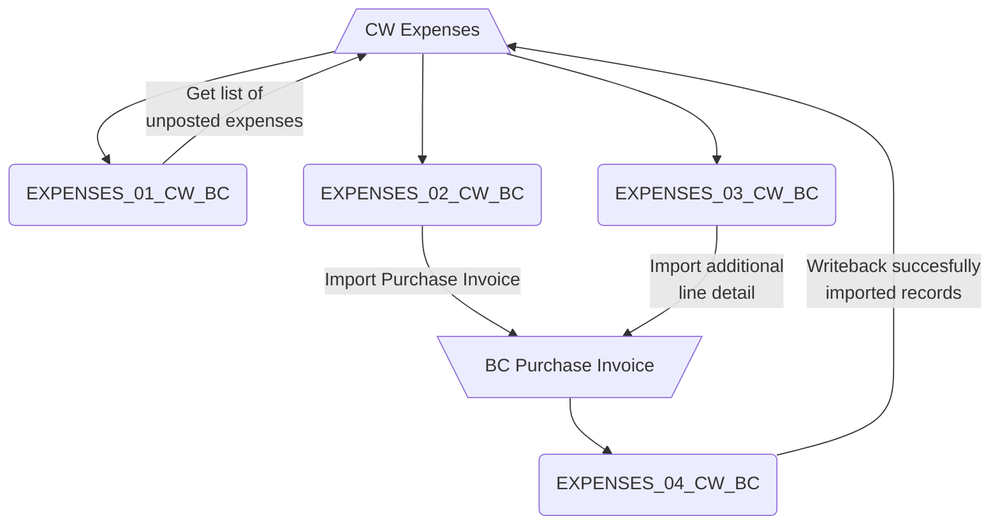
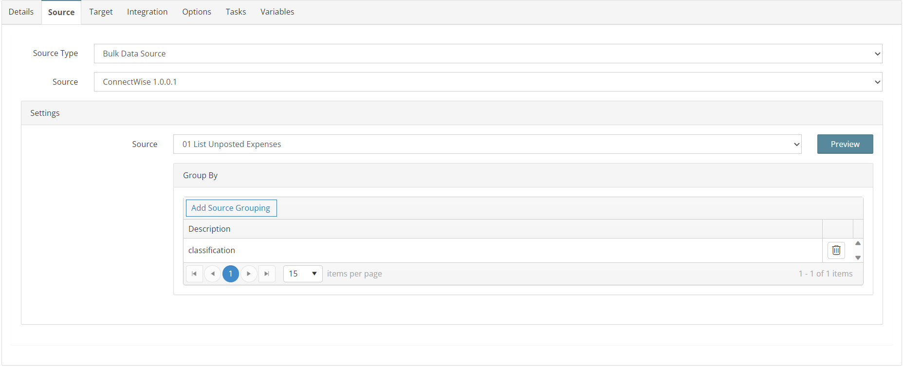
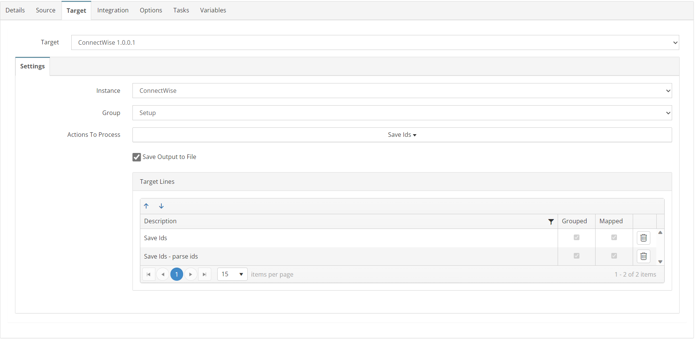
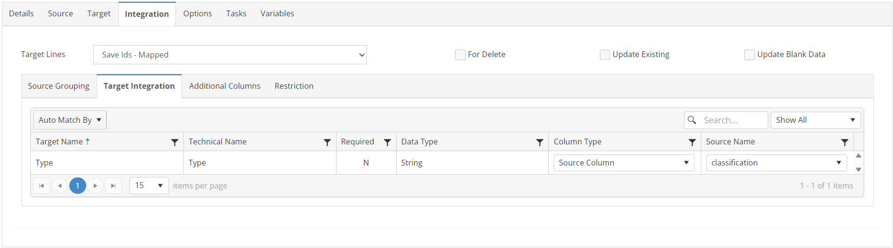
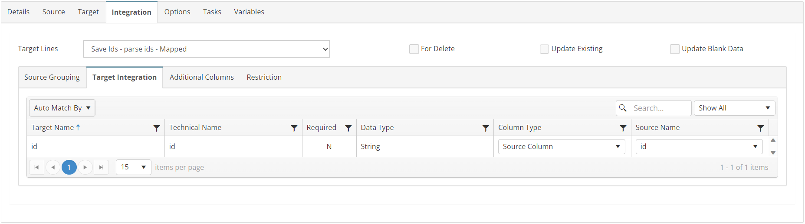
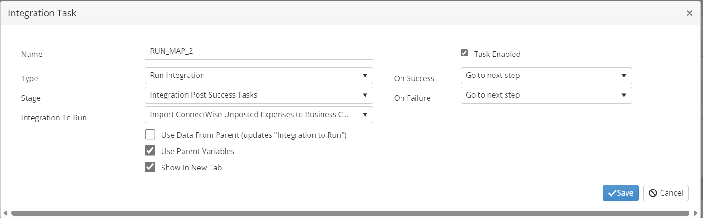

# EXPENSES_01_CW_BC
Retrieve a List of Unposted ConnectWise Expenses

## Overview
This integration will query for a list of unprocessed Expenses. This list is then mapped to integration EXPENSES_02_CW_BC in a child task.

*Note: The target is a "dummy" file and will not send anything to ConnectWise. It is just a placeholder destination to allow SmartConnect to parse the list of Ids for map 2.*

## Source
**Filters**
| Key    | Value |
| -------- | ------- |
| conditions | classification='Reimbursable' |
|fields | id,expenseDetailId,classification    |



## Target


## Integration

### Save Ids
```javascript
return true;
```


### Save Ids - parse ids
```javascript
//append Id to list for filter in map 2
this.GBL_CW_UNPOSTED_IDS += this._id_string;
return true;
```


## Tasks

### INIT_VARIABLES
| Option    | Value |
| -------- | ------- |
| Type  | Run Script   |
| Stage | Integration Pre Tasks  |
```javascript
//initialize variables that are used in child integrations
var myvar = this.GBL_CW_EXPENSE_IDS;
myvar = this.GBL_CW_ALL_IDS;
myvar = this.GBL_CW_BATCH;
myvar = this.GBL_CW_ID;
return true;
```

### RUN_MAP_2
| Option    | Value |
| -------- | ------- |
| Type  | Run Integration   |
| Stage | Integration Post Success Tasks  |
| Integration To Run | EXPENSES_02_CW_BC  |

