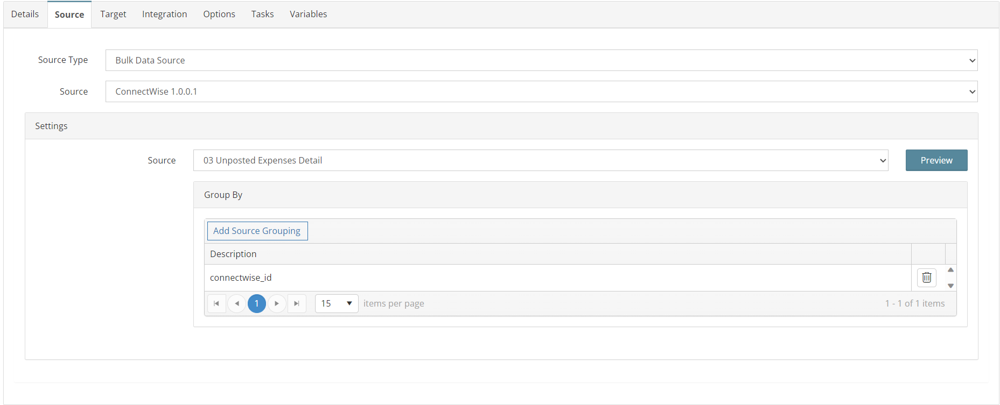
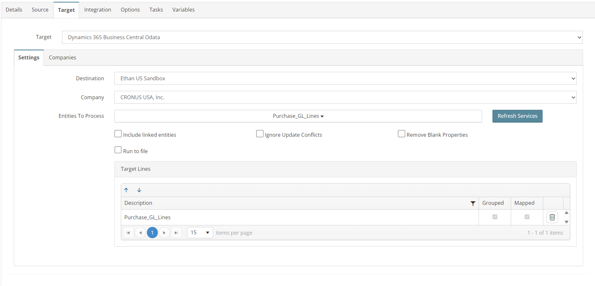
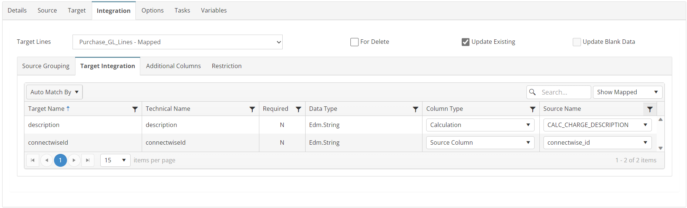
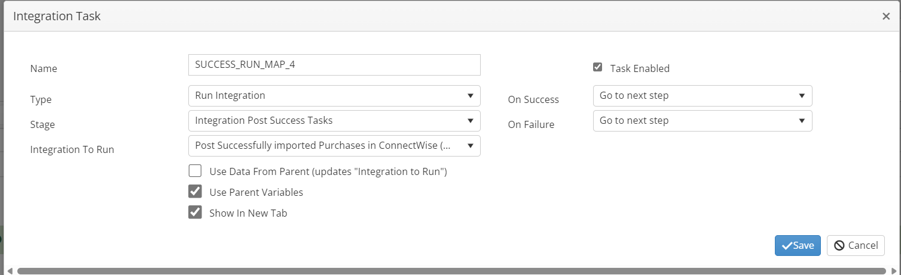

# EXPENSES_03_CW_BC
Import additional Expense line level detail

## Overview
This integration will add additional line level detail to the Expense Purchase Invoices. The export endpoint used by EXPENSES_02_CW_BC is missing some detail such as the charge description.

## Source
**Filters**
| Key    | Value |
| -------- | ------- |
| conditions | id in (GBL_CW_EXPENSE_IDS) |



## Target


## Integration


### Purchase_GL_Lines
```javascript
return true;
```


## Tasks

### INIT_VARIABLE
| Option    | Value |
| -------- | ------- |
| Type  | Run Script   |
| Stage | Integration Pre Tasks  |
```javascript
//initialize variables that are used in Map 4 but not Map 3
var myvar = this.GBL_CW_EXPENSE_IDS;
myvar = this.GBL_CW_BATCH;
myvar = this.GBL_CW_ALL_IDS;
return true;
```


### SUCCESS_RUN_MAP_4
| Option    | Value |
| -------- | ------- |
| Type  | Run Integration   |
| Stage | Integration Post Success Tasks  |
| Integration To Run | EXPENSES_04_CW_BC  |


