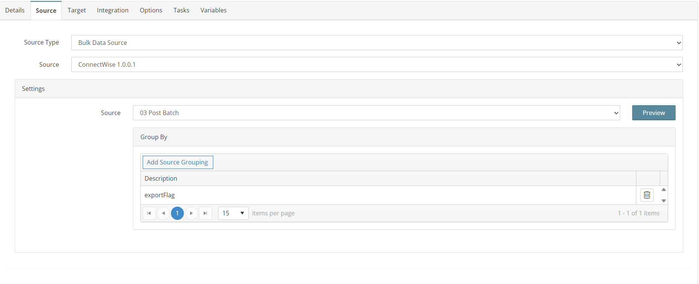
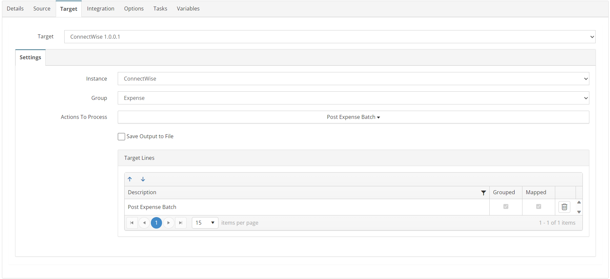
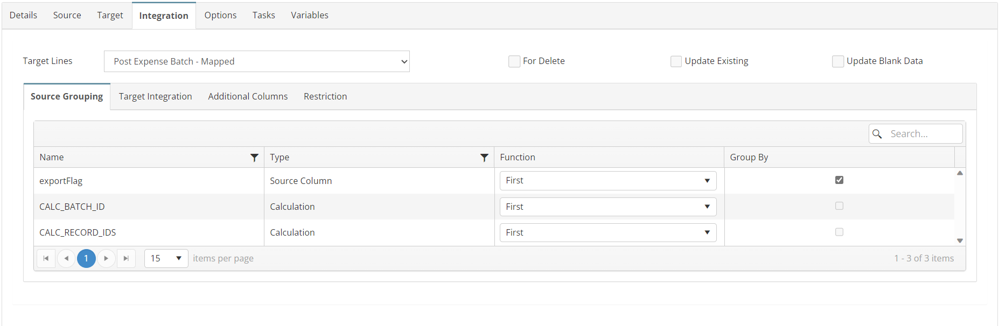

# EXPENSES_04_CW_BC
Post Successfully imported Purchases in ConnectWise

## Overview
This integration will writeback the Ids for all successfully imported Expenses to ConnectWise to post them. Once the Invoices are posed in ConnectWise they will no longer be picked up by the integration.

*Note: The data source is a "dummy" response that always returns 'True' this will never change. It is a SmartConenct requirement to always map at least one source field to the target. This is our way around the requirement when all our values are in Global Variables.*

## Source
**Filters**
None



## Target


## Integration

### Post Expense Batch
```javascript
return true;
```



## Tasks
None