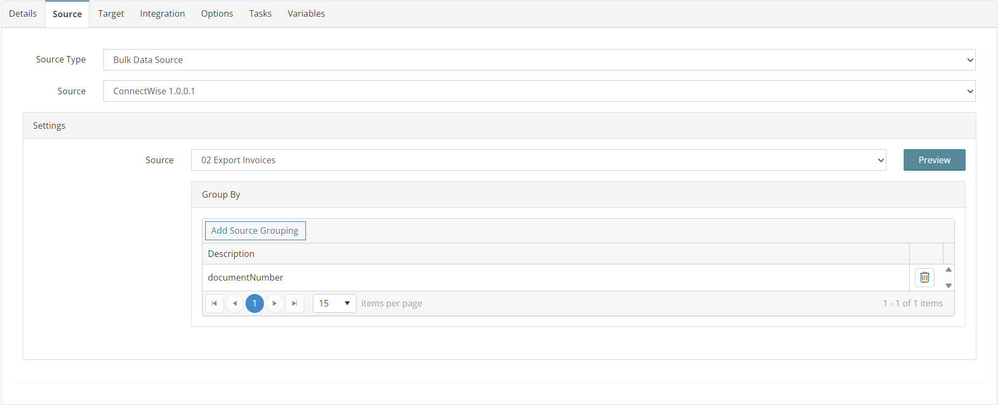
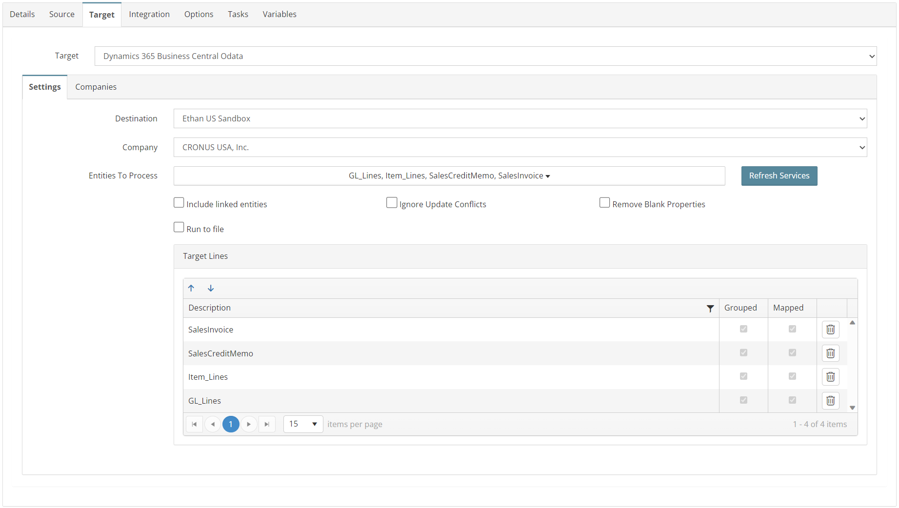
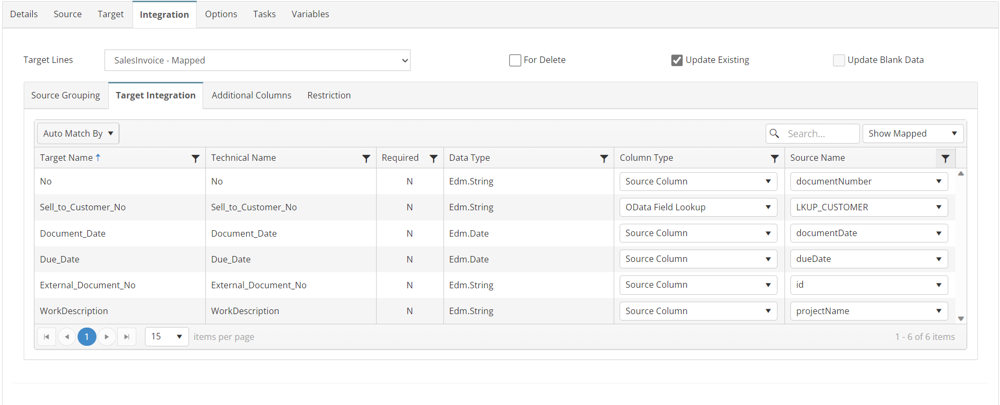
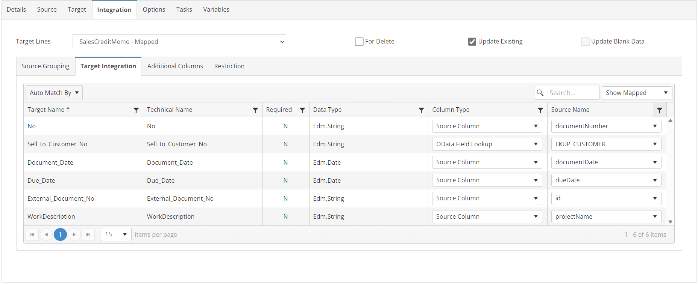
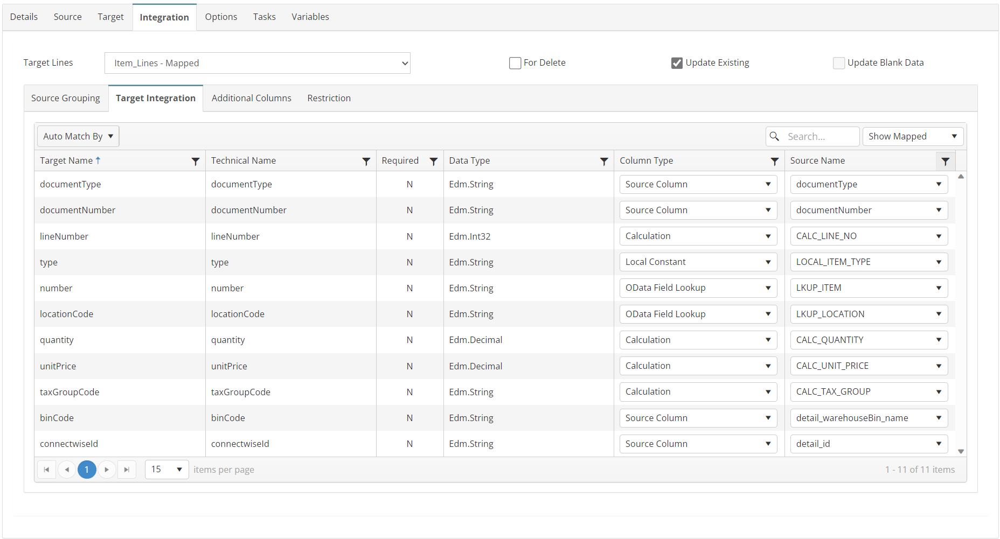
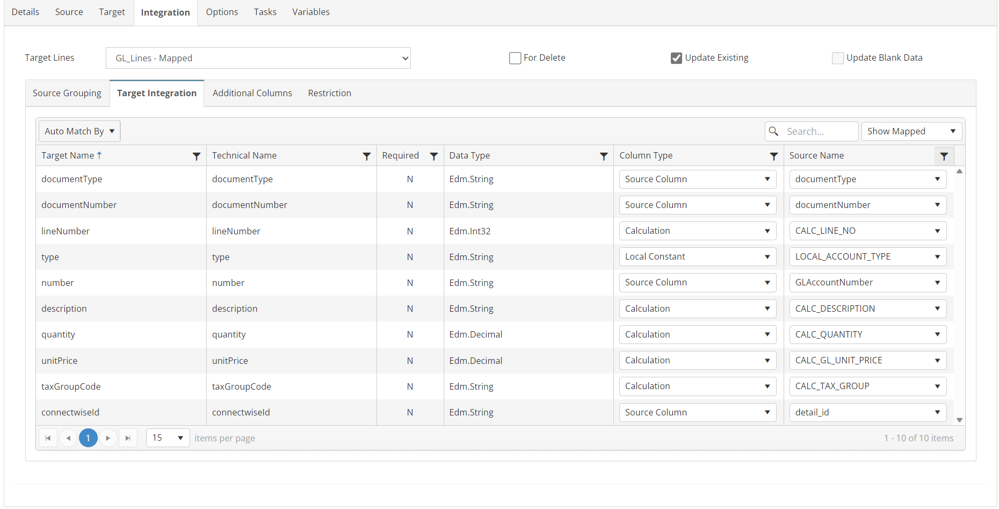
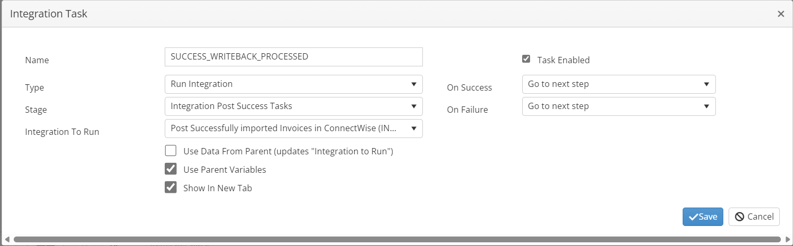
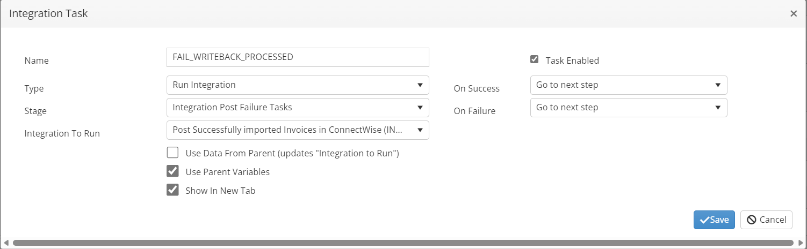

# INVOICES_02_CW_BC
Import ConnectWise Unposted Invoices to Business Central

## Overview
This integration will import all invoices from ConnectWise as either open Sales Invoices or Credit Memos based on the document type.

*Note: The STORE_SUCCESS_VARIABLE task will create a list of all successfully processed ids so they can be posted in ConnectWise by map 3.*

## Source
**Filters**
```json
{
    "batchIdentifier": "01",
    "glInterfaceIdentifier": "01",
    "summarizeInvoices": "Default",
    "exportInvoicesFlag": true,
    "includedInvoiceIds": [
    [[unprocessedIds]]
    ]
}
```



## Target


## Integration

### SalesInvoice
```javascript
//Restriction to check document type and set GL Entry Ids for writeback
if (this._documentType == "INVOICE") {
    this.GBL_CW_ID += this._glEntryIds + ",";
	return true;
} else {
	return false;
}
```


### SalesCreditMemo
```javascript
//Restriction to check document type and set GL Entry Ids for writeback
if (this._documentType == "CREDIT MEMO") {
    this.GBL_CW_ID += this._glEntryIds + ",";
	return true;
} else {
	return false;
}
```


### Item_Lines
```javascript
//declare item gl types
var gl_types = this.GBL_CW_ITEM_GL_TYPES.split(",")
//Restriction script to determine line type
if (gl_types.includes(this._detail_glTypeId)) {
    this.GBL_CW_ID += this._detail_id_string;
    return true;
} else {
    return false;
}
```


### GL_Lines
```javascript
//declare item gl types
var gl_types = (this.GBL_CW_ITEM_GL_TYPES + ",ST").split(",")
//Restriction script to determine line type
if (!gl_types.includes(this._detail_glTypeId)) {
    this.GBL_CW_ID += this._detail_id_string;
    return true;
} else {
    return false;
}
```


## Tasks

### INIT_VARIABLES
| Option    | Value |
| -------- | ------- |
| Type  | Run Script   |
| Stage | Integration Pre Tasks  |
```javascript
//initialize variables for processing
var mystring = this.GBL_CW_UNPOSTED_IDS;
mystring = this.GBL_CW_ITEM_GL_TYPES;
this.GBL_CW_ID = "";
this.GBL_CW_ALL_IDS = "";
//Calculate the Batch Id 'must be unique'
nd = new Date();
this.GBL_CW_BATCH = "SC-SALES-" + nd.toISOString().slice(0, 19);
return true;
```
### STORE_SUCCESS_VARIABLES
| Option    | Value |
| -------- | ------- |
| Type  | Run Script   |
| Stage | Document Post Success Tasks  |
```javascript
//Add to invoice writeback list
this.GBL_CW_ALL_IDS += this.GBL_CW_ID;
return true;
```

### CLEAR_FAIL_VARIABLES
| Option    | Value |
| -------- | ------- |
| Type  | Run Script   |
| Stage | Document Post Failure Tasks  |
```javascript
//remove ids for failed document
this.GBL_CW_ID = "";
return true;
```

### SUCCESS_WRITEBACK_PROCESSED
| Option    | Value |
| -------- | ------- |
| Type  | Run Integration   |
| Stage | Integration Post Success Tasks  |
| Integration To Run | INVOICES_03_CW_BC  |



### FAIL_WRITEBACK_PROCESSED
| Option    | Value |
| -------- | ------- |
| Type  | Run Integration   |
| Stage | Integration Post Failure Tasks  |
| Integration To Run | INVOICES_03_CW_BC  |

