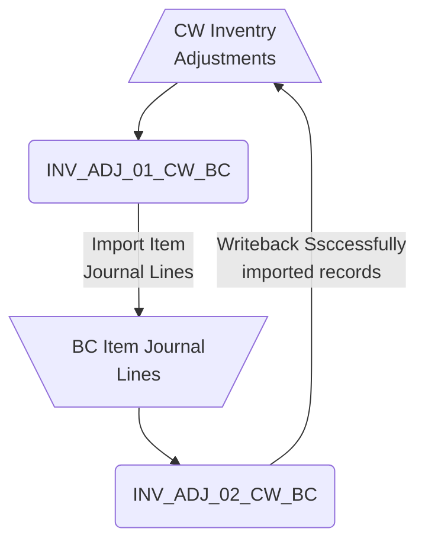
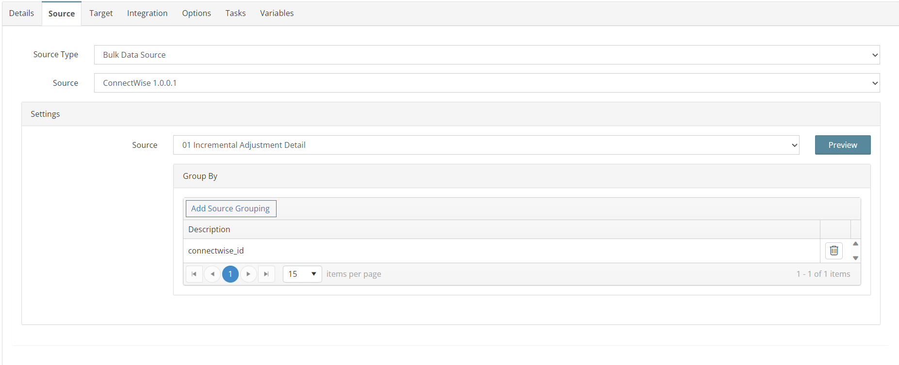
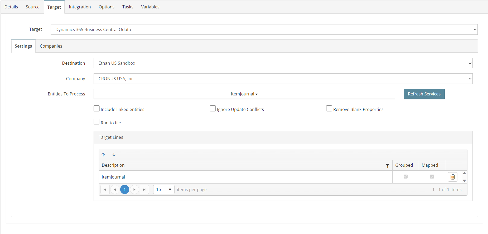
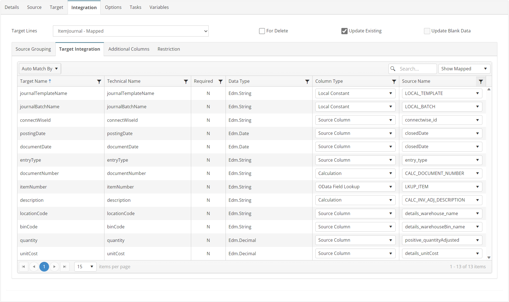
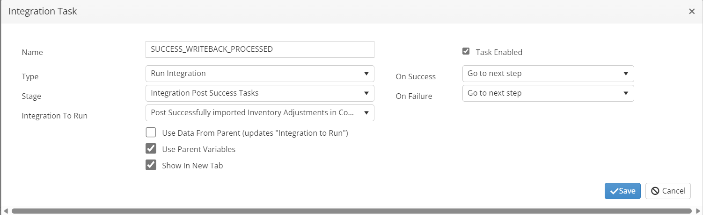
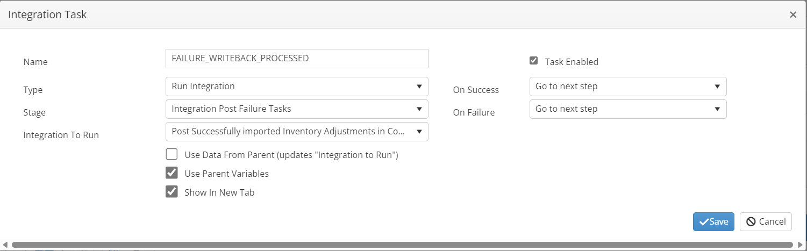

# INV_ADJ_01_CW_BC
Import CW Inventory Adjustments as BC Item Journal Lines

## Overview
This integration will query for a list of newly closed Inventory Adjustments and create Item Journal Lines for these changes.



## Source
**Filters**
| Key    | Value |
| -------- | ------- |
| conditions | closedFlag = true and closedDate >= [GBL_CW_DATE]     |



## Target


## Integration

### ItemJournal
```javascript
return true;
```


## Tasks

### INIT_VARIABLES
| Option    | Value |
| -------- | ------- |
| Type  | Run Script   |
| Stage | Integration Pre Tasks  |

```javascript
//initialize variables for processing
//initialize variables for processing
this.GBL_CW_ID = "";
this.GBL_CW_ADJUSTMENT_IDS = "";
//Calculate the Batch Id 'must be unique'
nd = new Date();
this.GBL_CW_BATCH = "SC-ADJUSTMENT-" + nd.toISOString().slice(0, 19);
//set staging date for source filter
this.GBL_CW_STAGING_DATE = nd.toISOString();
return true;
```
### STORE_SUCCESS_VARIABLES
| Option    | Value |
| -------- | ------- |
| Type  | Run Script   |
| Stage | Document Post Success Tasks  |

```javascript
//Save a list of Ids for posting integration
this.GBL_CW_ADJUSTMENT_IDS += this._id + "-adjustment,"
return true;
```

### SUCCESS_WRITEBACK_PROCESSED
| Option    | Value |
| -------- | ------- |
| Type  | Run Integration   |
| Stage | Integration Post Success Tasks  |
| Integration To Run | INV_ADJ_02_CW_BC  |



### SUCCESS_SET_NEXT_RUN_DATE_TIME
| Option    | Value |
| -------- | ------- |
| Type  | Run Script   |
| Stage | Integration Post Success Tasks  |

```javascript
//Set date filter for next run
var nd = new Date(this.GBL_CW_STAGING_DATE);
// format DateTime - ISO 8601 - yyyy-MM-ddThh:mm:ss:miZ
this.GBL_CW_DATE = nd.toISOString();
return true;
```

### FAILURE_WRITEBACK_PROCESSED
| Option    | Value |
| -------- | ------- |
| Type  | Run Integration   |
| Stage | Integration Post Failure Tasks  |
| Integration To Run | INV_ADJ_02_CW_BC  |



### FAILURE_SET_NEXT_RUN_DATE_TIME
| Option    | Value |
| -------- | ------- |
| Type  | Run Script   |
| Stage | Integration Post Failure Tasks  |

```javascript
//Set date filter for next run
var nd = new Date(this.GBL_CW_STAGING_DATE);
// format DateTime - ISO 8601 - yyyy-MM-ddThh:mm:ss:miZ
this.GBL_CW_DATE = nd.toISOString();
return true;
```