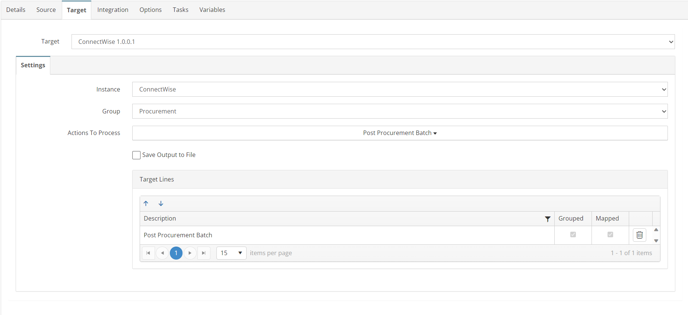

# INV_ADJ_02_CW_BC
Post Successfully imported Inventory Adjustments in ConnectWise

## Overview
This integration will writeback the Ids for all successfully imported Inventory Adjustments to ConnectWise to post them. Once posted, the adjustments will no longer show on the Accounting Interface in ConnectWise.

*Note: The target of this integration is using aggregated grouping to concatenate all ids into a single field. This is controlled by the grouping on the Integration > Source Grouping tab.*

## Source
**Filters**
| Key    | Value |
| -------- | ------- |
| conditions | unpostedProductId in (GBL_CW_ADJUSTMENT_IDS)    |
| fields | id,unpostedProductId,description     |


## Target


## Integration

### Post Procurement Batch
```javascript
return true;
```


## Tasks

### INIT_VARIABLES
| Option    | Value |
| -------- | ------- |
| Type  | Run Script   |
| Stage | Integration Pre Tasks  |

```javascript
//initialize variables for processing
var mystring = this.GBL_CW_BATCH;
mystring = this.GBL_CW_EXPENSE_IDS;
return true;
```