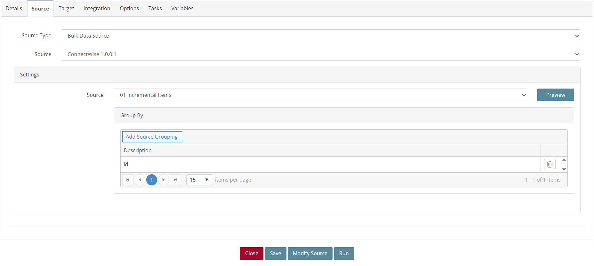
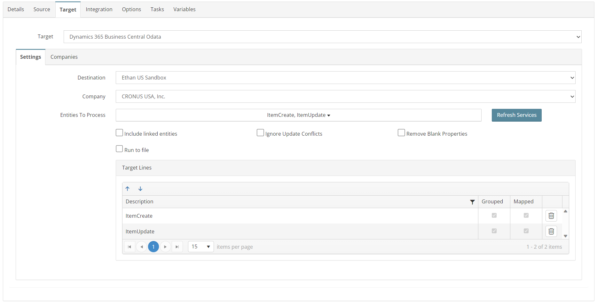
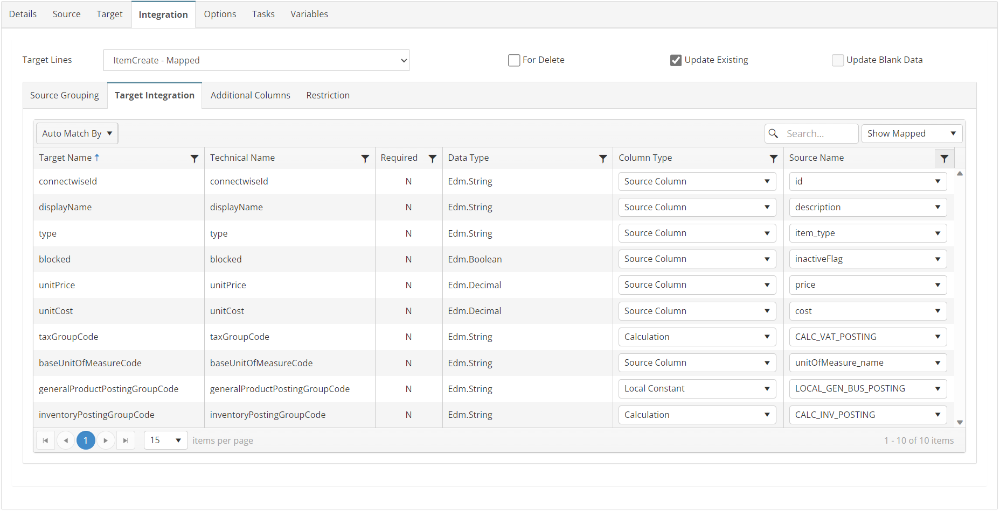
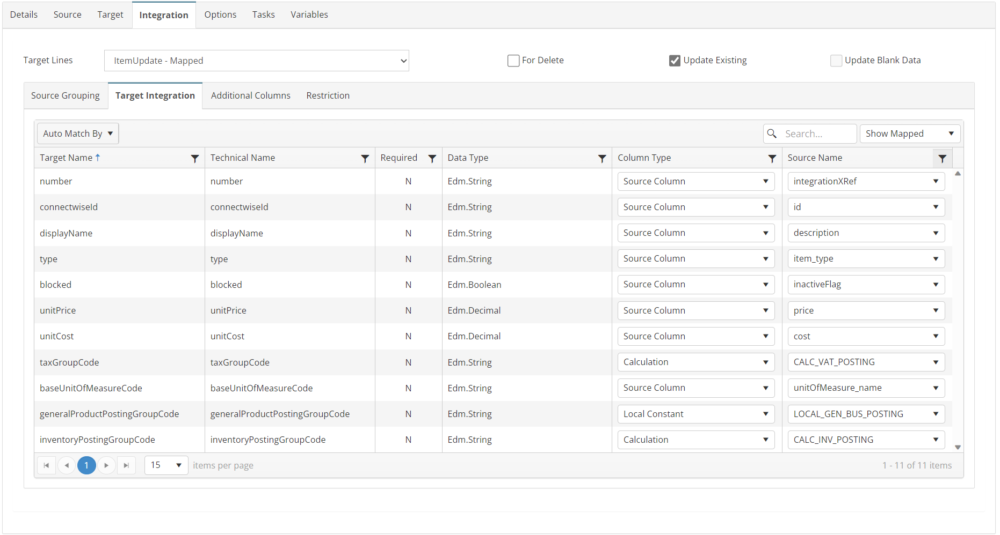

# ITEMS_01_CW_BC
ConnectWise Products to Business Central Items

## Overview
This integration will incrementally query product catalog records from ConnectWise based on a date filter and push them into Business Central as Items.

## Source
**Filters**
| Key    | Value |
| -------- | ------- |
| conditions | lastUpdated>=[GBL_CW_DATE]     |



## Target


## Integration

### ItemCreate
```javascript
//Use this mapping if integrationXRef field is blank
if (!this._integrationXRef && !this._inactiveFlag) {
    return true;
} else {
    return false;
}
```


### ItemUpdate
```javascript
//Use this mapping if integrationXRef field is populated
if (this._integrationXRef) {
    return true;
} else {
    return false;
}
```


## Tasks

### INIT_VARIABLE
| Option    | Value |
| -------- | ------- |
| Type  | Run Script   |
| Stage | Integration Pre Tasks  |
```javascript
//Store current date in a variable
var nd = new Date();
this.GBL_CW_STAGING_DATE = nd.toISOString();
return true;
```

### FAILURE_SET_NEXT_RUN_DATE_TIME
| Option    | Value |
| -------- | ------- |
| Type  | Run Script   |
| Stage | Integration Post Failure Tasks  |
```javascript
//Set date filter for next run
var nd = new Date(this.GBL_CW_STAGING_DATE);
// format DateTime - ISO 8601 - yyyy-MM-ddThh:mm:ss:miZ
this.GBL_CW_DATE = nd.toISOString();
return true;
```

### SUCCESS_SET_NEXT_RUN_DATE_TIME
| Option    | Value |
| -------- | ------- |
| Type  | Run Script   |
| Stage | Integration Post Success Tasks  |
```javascript
//Set date filter for next run
var nd = new Date(this.GBL_CW_STAGING_DATE);
// format DateTime - ISO 8601 - yyyy-MM-ddThh:mm:ss:miZ
this.GBL_CW_DATE = nd.toISOString();
return true;
```