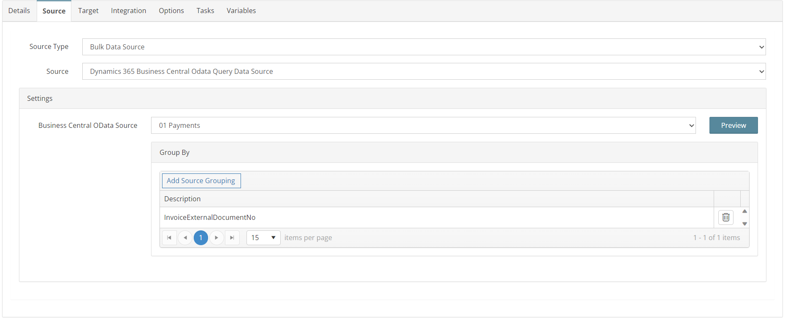
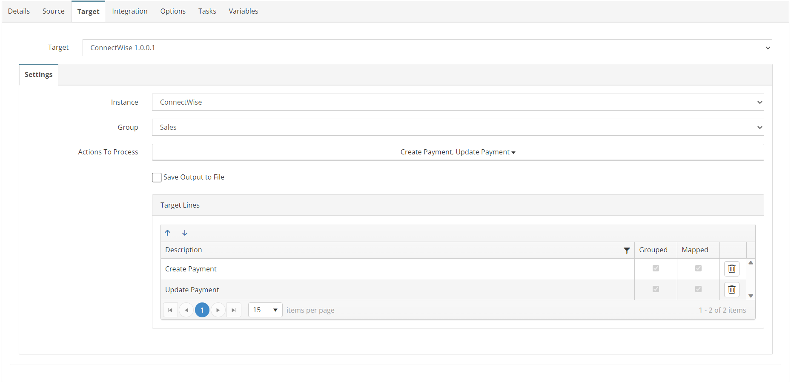
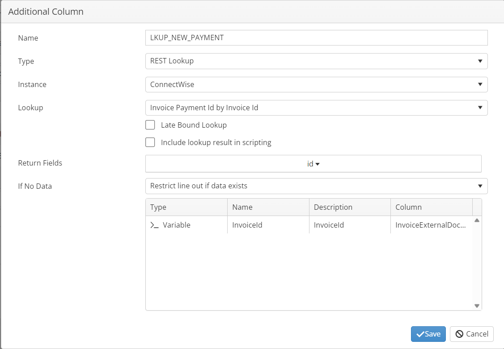
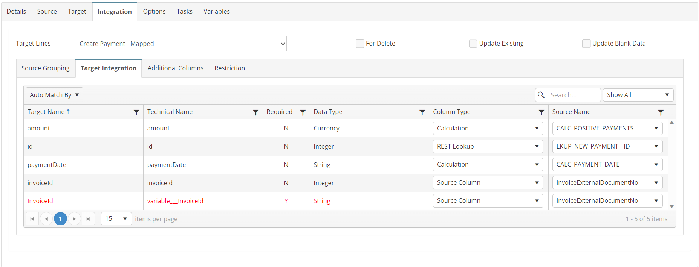
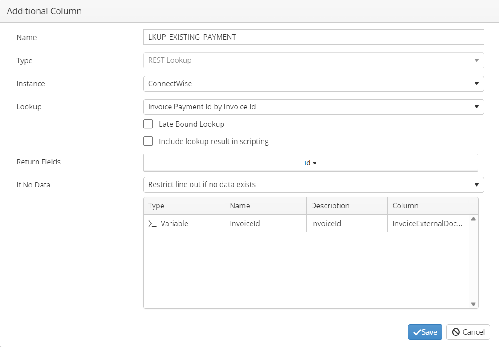
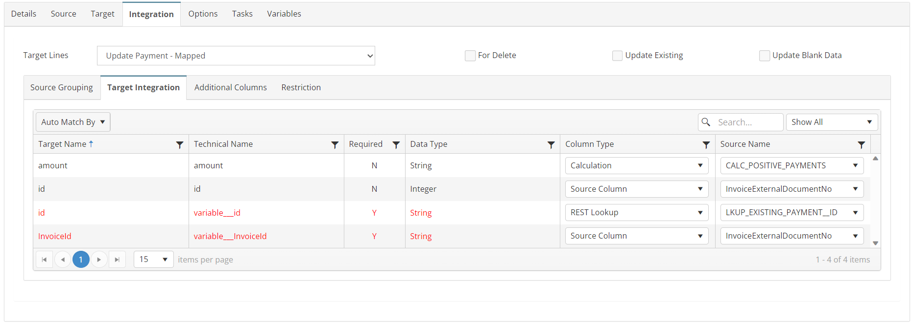

# PAYMENTS_01_BC_CW
Apply Business Central Customer Payments to ConnectWise Invoices

## Overview
This integration will create/update payments from BC against ConnectWise Invoices. This integration will incrementally filter the customer ledger table for new payments based on time stamps.

## Source
**Filters**
| Field    | Operator | Value |
| -------- | ------- | ------- |
| PaymentCreatedAt   | >   | GBL_BC_DATE  |
| InvoiceExternalDocumentNo |   <>  | ''|



## Target


## Integration

### Create Payment
#### Restriction
Use this mapping if a Payment record does not exist in ConnectWise.

#### Mapping


### Update Payment
#### Restriction
Use this mapping if a Payment record does exist in ConnectWise.

#### Mapping


## Tasks

### INIT_VARIABLE
| Option    | Value |
| -------- | ------- |
| Type  | Run Script   |
| Stage | Integration Pre Tasks  |
```javascript
//Store current date in a variable
var nd = new Date();
this.GBL_CW_STAGING_DATE = nd.toISOString();
return true;
```

### FAILURE_SET_NEXT_RUN_DATE_TIME
| Option    | Value |
| -------- | ------- |
| Type  | Run Script   |
| Stage | Integration Post Failure Tasks  |
```javascript
//Set date filter for next run
this.GBL_BC_DATE = this.GBL_CW_STAGING_DATE;
return true;
```

### SUCCESS_SET_NEXT_RUN_DATE_TIME
| Option    | Value |
| -------- | ------- |
| Type  | Run Script   |
| Stage | Integration Post Success Tasks  |
```javascript
//Set date filter for next run
this.GBL_BC_DATE = this.GBL_CW_STAGING_DATE;
return true;
```