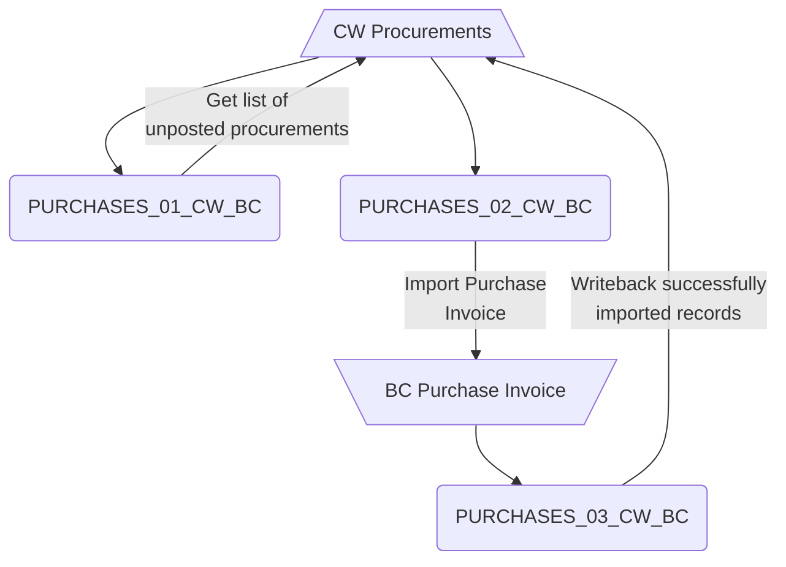
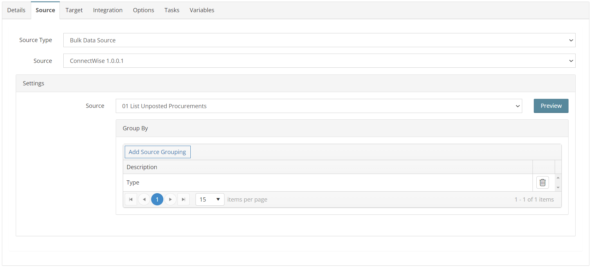
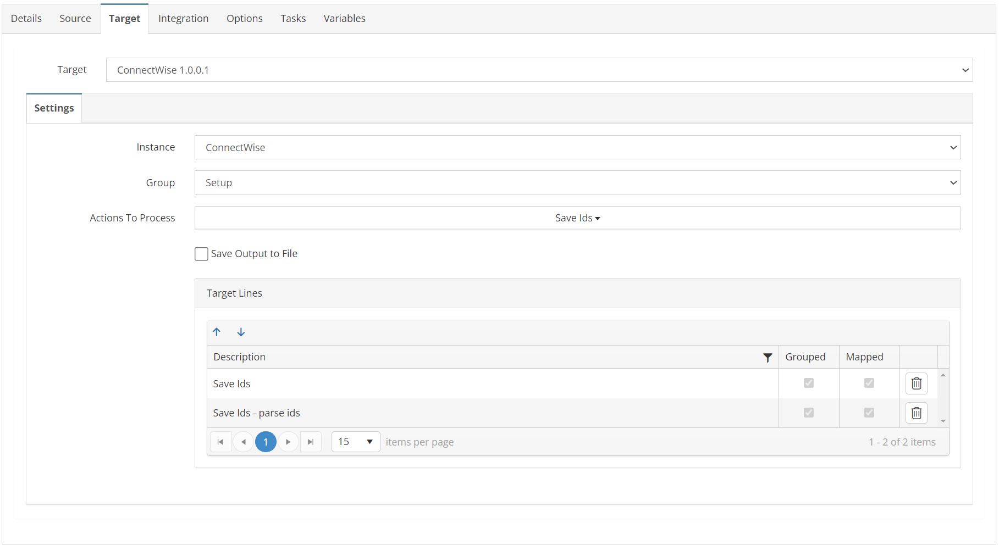
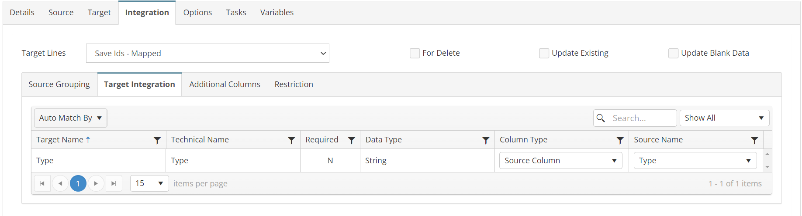
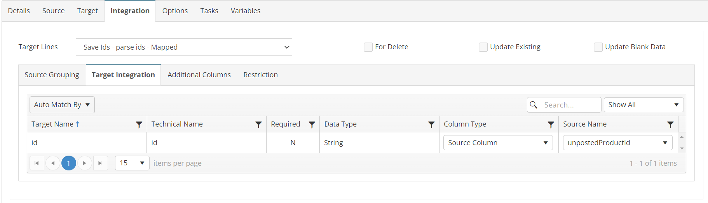
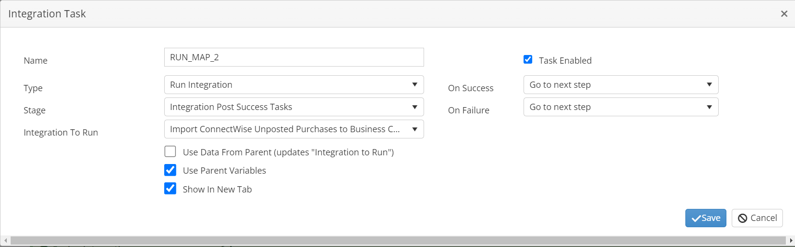

# PURCHASES_01_CW_BC

Retrieve a List of Unposted ConnectWise Purchases

## Overview

This integration will query for a list of unprocessed Procurement Ids. This list is then mapped to integration PURCHASES_02_CW_BC in a child task.

*Note: The target is a "dummy" file and will not send anything to ConnectWise. It is just a placeholder destination to allow SmartConnect to parse the list of Ids for map 2.*



## Source

**Filters**
| Key | Value |
| -------- | ------- |
| conditions | procurementType='Purchase' |



## Target



## Integration

### Save Ids
```javascript
return true;
```


### Save Ids - parse ids
```javascript
//append Id to list for filter in map 2
this.GBL_CW_UNPOSTED_IDS += this._id_string;
return true;
```


## Tasks

### INIT_VARIABLES
| Option    | Value |
| -------- | ------- |
| Type  | Run Script   |
| Stage | Integration Pre Tasks |

```javascript
//script to intitialize variables used by child integrations
var mystring = this.GBL_CW_ALL_IDS;
mystring = this.GBL_CW_ID;
mystring = this.GBL_CW_PROCUREMENT_IDS;
mystring = this.GBL_CW_BATCH;
return true;
```

### RUN_MAP_2
| Option    | Value |
| -------- | ------- |
| Type  | Run Integration   |
| Stage | Integration Post Success Tasks  |
| Integration To Run | PURCHASES_02_CW_BC  |


