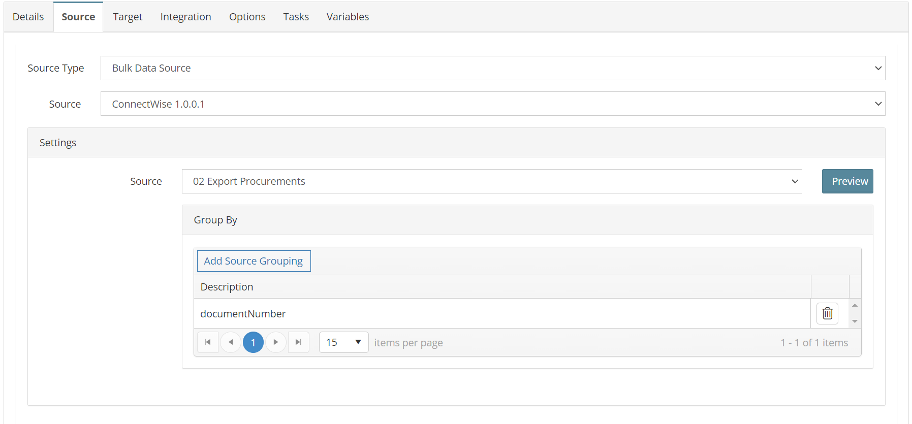
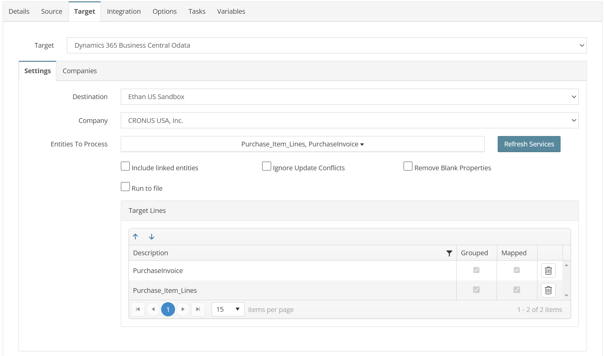
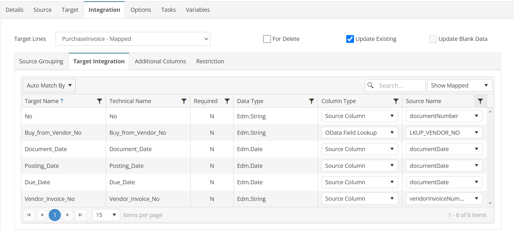
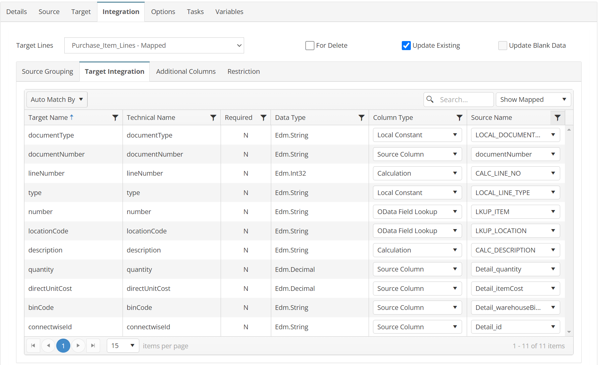
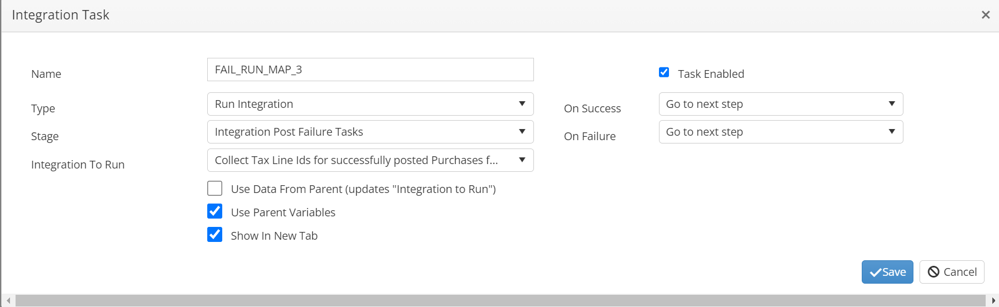

# PURCHASES_02_CW_BC
Import ConnectWise Unposted Purchases to Business Central

## Overview
This integration will import all invoices from ConnectWise as either open Purchase Invoices.

*Note: The STORE_SUCCESS_VARIABLE task will create a list of all successfully processed ids so they can processed by by maps 3 & 4.*

## Source
**Filters**
```json
{
  "batchIdentifier": "0",
  "glInterfaceIdentifier": "0",
  "locationId": 0,
  "summarizeInvoices": "Default",
  "exportProductsFlag": true,
  "includedProductIds": [
    GBL_CW_UNPOSTED_IDS
  ],
}
```



## Target


## Integration

### PurchaseInvoice
```javascript
return true;
```


### Purchase_Item_Lines
```javascript
//use mapping if GL type is not freight
if (this._DetailglTypeId != "PF") {
  //save id for writeback
  this.GBL_CW_ID += this._Detail_id_string;
  return true;
} else {
  return false;
}
```


## Tasks

### INIT_VARIABLES
| Option    | Value |
| -------- | ------- |
| Type  | Run Script   |
| Stage | Integration Pre Tasks  |
```javascript
//initialize variables for processing
var mystring = this.GBL_CW_UNPOSTED_IDS;
this.GBL_CW_ID = "";
this.GBL_CW_ALL_IDS = "";
this.GBL_CW_PROCUREMENT_IDS = "";
//Calculate the Batch Id 'must be unique'
var nd = new Date();
this.GBL_CW_BATCH = "SC-PURCH-" + nd.toISOString().slice(0, 19);
return true;
```
### STORE_SUCCESS_VARIABLES
| Option    | Value |
| -------- | ------- |
| Type  | Run Script   |
| Stage | Document Post Success Tasks  |
```javascript
//Add to invoice writeback list
this.GBL_CW_ALL_IDS += this.GBL_CW_ID;
this.GBL_CW_PROCUREMENT_IDS += this._Document_number_string;
this.GBL_CW_ID = "";
return true;
```

### CLEAR_FAIL_VARIABLES
| Option    | Value |
| -------- | ------- |
| Type  | Run Script   |
| Stage | Document Post Failure Tasks  |
```javascript
//remove ids for failed document
this.GBL_CW_ID = "";
return true;
```

### SUCCESS_RUN_MAP_3
| Option    | Value |
| -------- | ------- |
| Type  | Run Integration   |
| Stage | Integration Post Success Tasks  |
| Integration To Run | PURCHASES_03_CW_BC  |


### FAIL_RUN_MAP_3
| Option    | Value |
| -------- | ------- |
| Type  | Run Integration   |
| Stage | Integration Post Failure Tasks  |
| Integration To Run | PURCHASES_03_CW_BC  |

