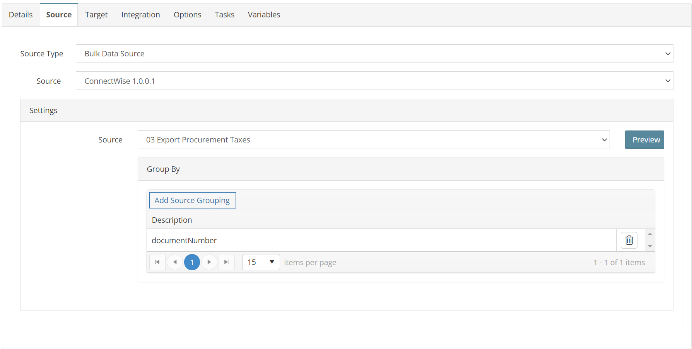
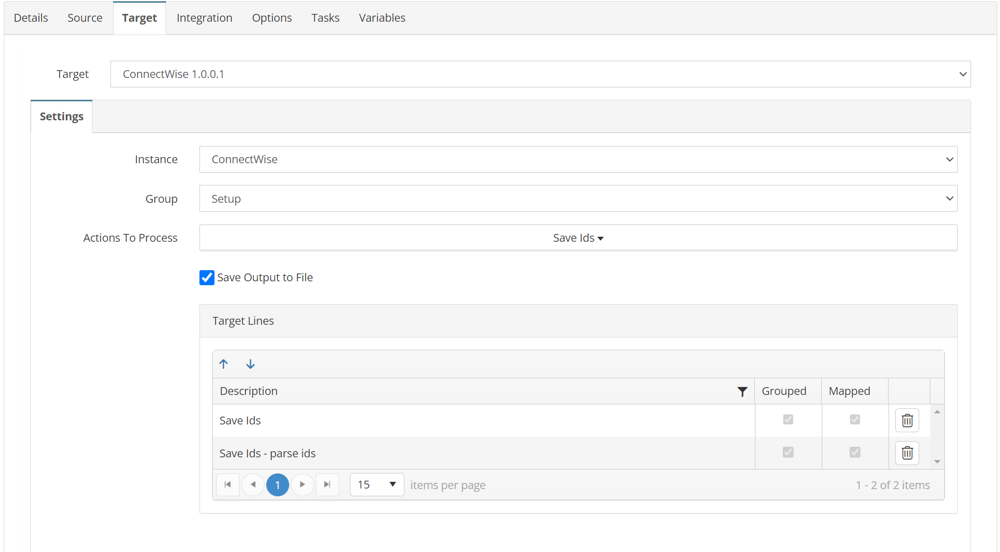
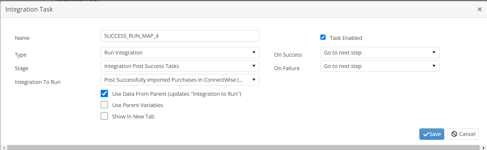

# PURCHASES_03_CW_BC
Collect Tax Line Ids for successfully posted Purchases for posting

## Overview
This integration will collect the line ids for all Tax lines.

*This integration uses a dummy destination and never sends data to ConnectWise.*

This integration is optional based on if your ConnectWise environment exports taxes on procurements or not. 
If your environment doesn't export taxes you can have Map 2 call Map 4 directly.


## Source
**Filters**
```json
{
  "batchIdentifier": "0",
  "glInterfaceIdentifier": "0",
  "locationId": 0,
  "summarizeInvoices": "Default",
  "exportProductsFlag": true
}
```



## Target


## Integration

### Save Ids
```javascript
return true;
```


### Save Ids - parse ids
```javascript
//only append tax ids for successfully imported procurements
var purchaseArray = this.GBL_CW_PROCUREMENT_IDS.split(",");
if (purchaseArray.includes(this._documentNumber)) {
  this.GBL_CW_ALL_IDS += this._id_String;
  return true;
} else {
  return false;
}
```


## Tasks

### INIT_VARIABLES
| Option    | Value |
| -------- | ------- |
| Type  | Run Script   |
| Stage | Integration Pre Tasks  |
```javascript
//declare batch variable for posting map.
var mystring = this.GBL_CW_BATCH;
mystring = this.GBL_CW_ALL_IDS;
return true;
```

### SUCCESS_RUN_MAP_4
| Option    | Value |
| -------- | ------- |
| Type  | Run Integration   |
| Stage | Integration Post Success Tasks  |
| Integration To Run | PURCHASES_04_CW_BC  |


