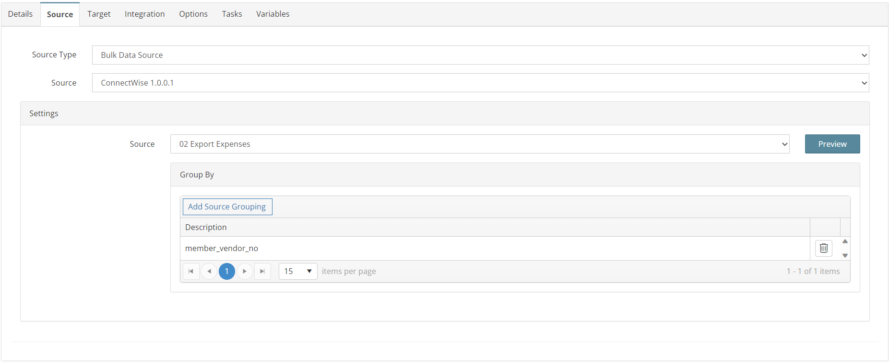
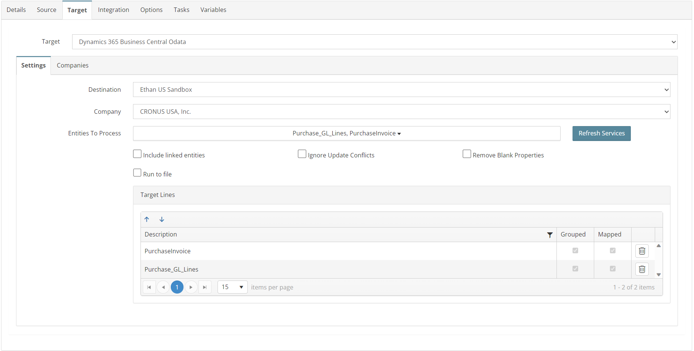
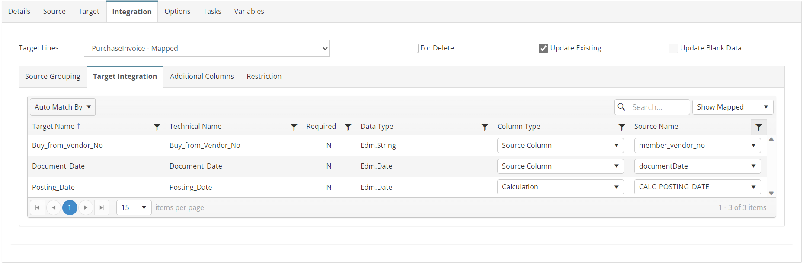
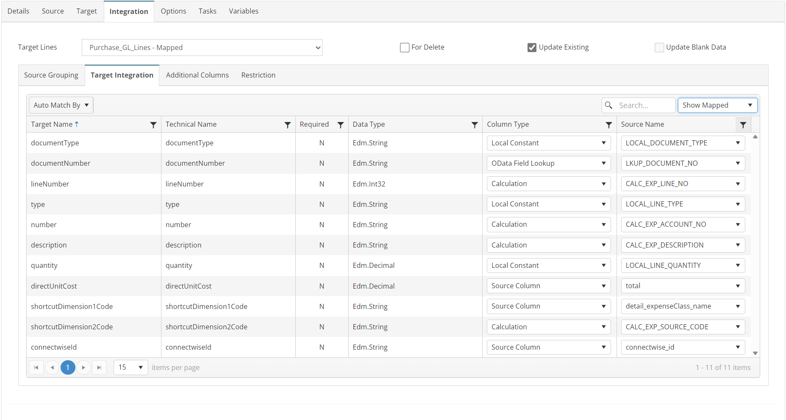
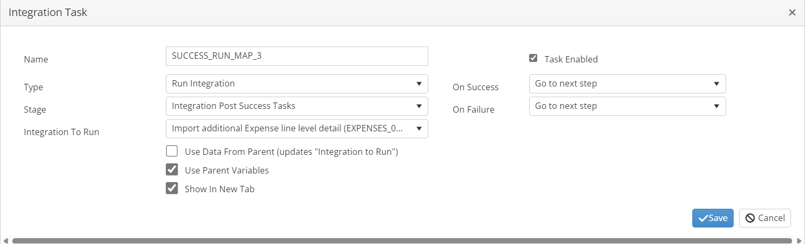
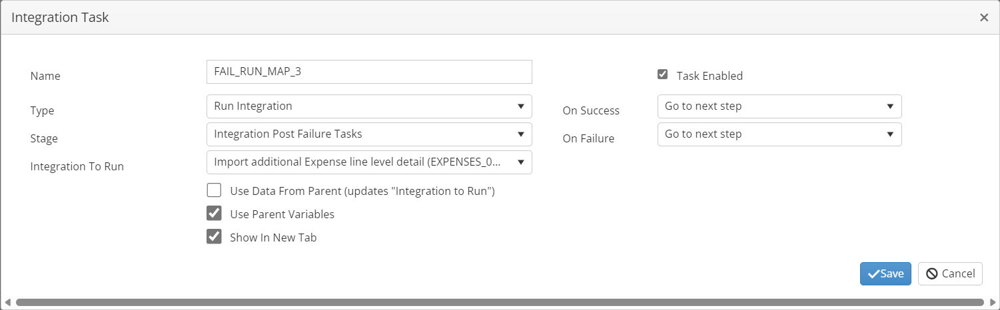

# EXPENSES_02_CW_BC
Import ConnectWise Unposted Expenses to Business Central

## Overview
This integration will import all expenses from ConnectWise as purchase invoices where the employee/member was imported using integration MEMBERS_01_CW_BC.

**Note: The STORE_SUCCESS_VARIABLE task will create a list of all successfully processed ids so additional expense detail can be added from another ConnectWise endpoint in map 3.*

***Note: The STORE_SUCCESS_VARIABLE task will create a list of all successfully processed ids so they can be posted in ConnectWise by map 4.*

## Source
**Filters**
```json
{
    "batchIdentifier": "0",
    "glInterfaceIdentifier": "0",
    "locationId": 0,
    "summarizeInvoices": "Detailed",
    "exportExpensesFlag": true,
    "includedExpenseIds": [
        [[unprocessedIds]]
    ],
}
```



## Target


## Integration

### PurchaseInvoice
```javascript
return true;
```


### Purchase_GL_Lines
```javascript
//Save ids for processing
this.GBL_CW_ID += (this._detail_id + ",");
this.GBL_CW_EXP_ID += this._id_string;
return true;
```


## Tasks

### INIT_VARIABLES
| Option    | Value |
| -------- | ------- |
| Type  | Run Script   |
| Stage | Integration Pre Tasks  |
```javascript
//initialize variables for processing
var mystring = this.GBL_CW_UNPOSTED_IDS;
this.GBL_CW_ID = "";
this.GBL_CW_ALL_IDS = "";
this.GBL_CW_EXPENSE_IDS = "0,";
//Calculate the Batch Id 'must be unique'
var nd = new Date();
this.GBL_CW_BATCH = "SC-EXPENSE-" + nd.toISOString().slice(0, 19);
return true;
```
### STORE_SUCCESS_VARIABLES
| Option    | Value |
| -------- | ------- |
| Type  | Run Script   |
| Stage | Document Post Success Tasks  |
```javascript
//Save a list of Ids for integrations 3 and 4
this.GBL_CW_ALL_IDS += this.GBL_CW_ID;
this.GBL_CW_EXPENSE_IDS += this.GBL_CW_EXP_ID;
this.GBL_CW_ID = "";
this.GBL_CW_EXP_ID = "";
return true;
```

### CLEAR_FAIL_VARIABLES
| Option    | Value |
| -------- | ------- |
| Type  | Run Script   |
| Stage | Document Post Failure Tasks  |
```javascript
//remove ids for failed document
this.GBL_CW_ID = "";
this.GBL_CW_EXP_ID = "";
return true;
```

### SUCCESS_RUN_MAP_3
| Option    | Value |
| -------- | ------- |
| Type  | Run Integration   |
| Stage | Integration Post Success Tasks  |
| Integration To Run | EXPENSES_03_CW_BC  |



### FAIL_RUN_MAP_3
| Option    | Value |
| -------- | ------- |
| Type  | Run Integration   |
| Stage | Integration Post Failure Tasks  |
| Integration To Run | EXPENSES_03_CW_BC  |

