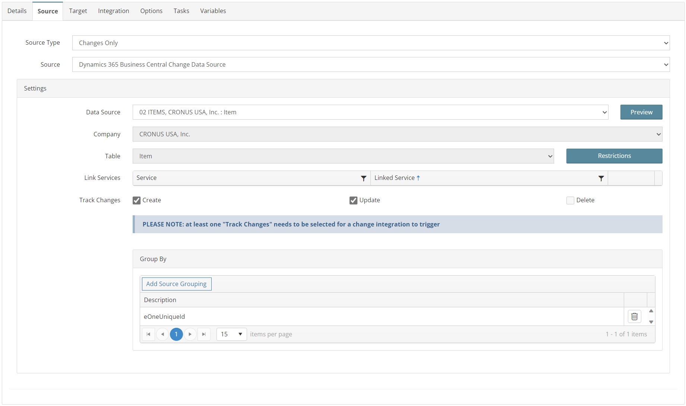
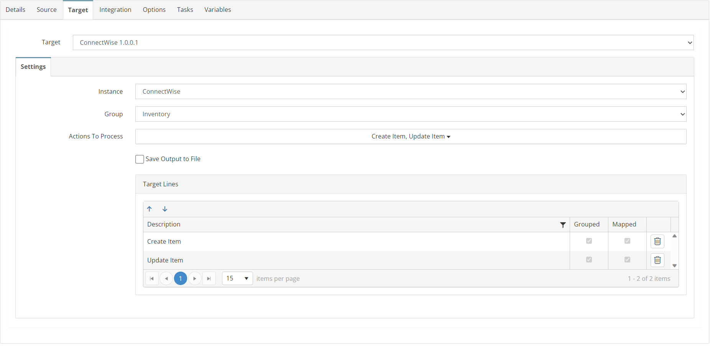
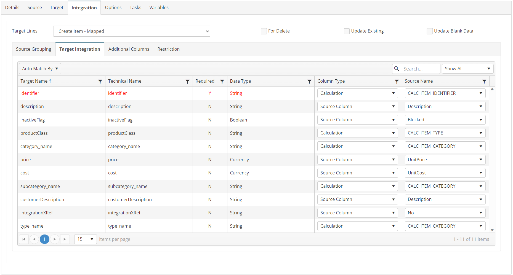
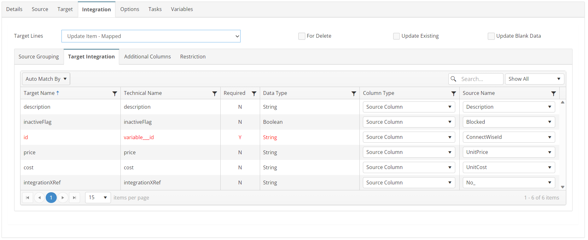

# ITEMS_02_BC_CW
Business Central Items to ConnectWise Products

## Overview
This integration will create/update recently modified BC Items in ConnectWise as products using the Business Central Change Tracking Extension.

## Source
**Filters**
None



## Target


## Integration

### Create Item
```javascript
//Use this mapping if ConnectWiseId field is blank
if (!this._ConnectWiseId) {
    return true;
} else {
    return false;
}
```


### Update Item
```javascript
//Use this mapping if ConnectWiseId field contains a value
if (this._ConnectWiseId) {
    return true;
} else {
    return false;
}
```


## Tasks
None