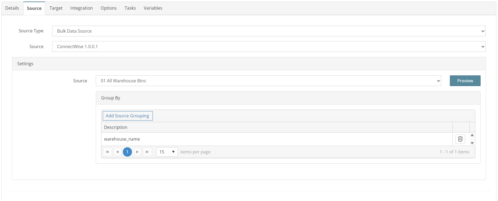
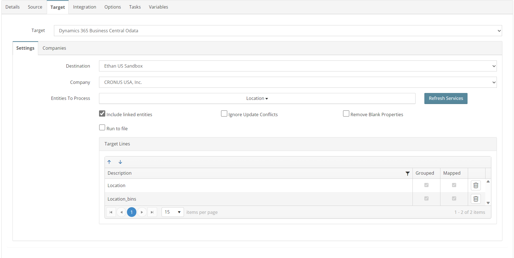
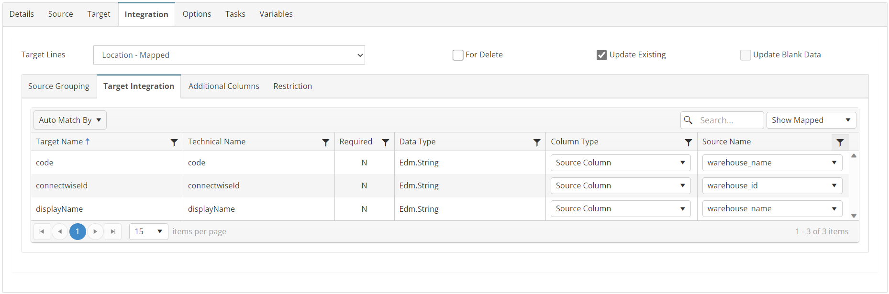
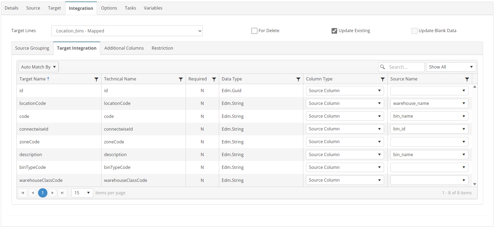

# LOCATIONS_BINS_01_CW_BC
ConnectWise Warehouse and Bins to Business Central Locations and Bins

## Overview
This integration will bulk create/update Locations and Bins in BC. This is an *optional* integration if you want to automate the creation of Locations and Bins in the Locations.

*Note: If you only want to create locations, but not bins, you can delete the mapping to Location_bins and only use the Location mapping.*

## Source
**Filters**
None



## Target


## Integration

### Location
```javascript
return true;
```


### Location_bins
```javascript
return true;
```


## Tasks
None