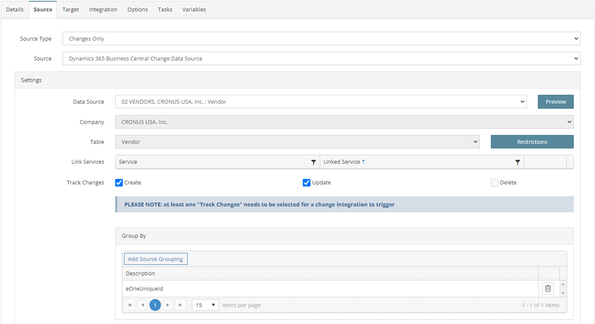
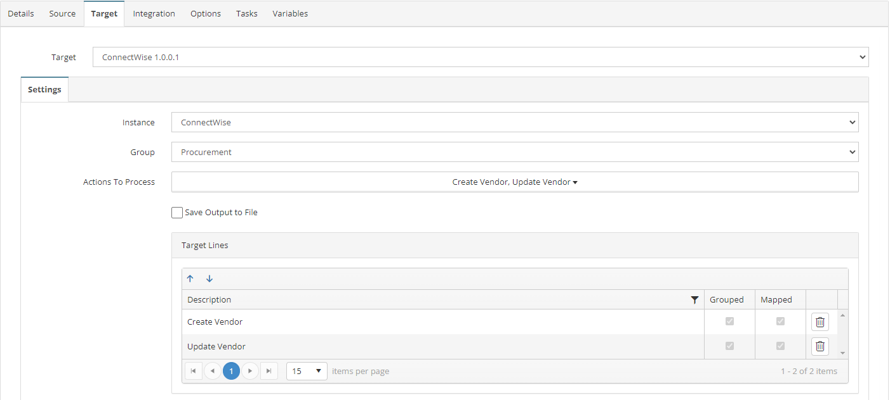

# VENDORS_02_BC_CW
Business Central Vendors to ConnectWise Companies

## Overview
This integration will create/update recently modified BC Vendors in ConnectWise.

## Source
**Filters**
None



## Target


## Integration

### Create Vendor
```javascript
//Use this mapping if ConnectWiseId field is blank and is not a member vendor
if (!this._ConnectWiseId && this._VendorPostingGroup != 'MEMBERS') {
    return true;
} else {
    return false;
}
```


### Update Vendor
```javascript
//Use this mapping if ConnectWiseId field contains a value and is not a member vendor
if (this._ConnectWiseId && this._VendorPostingGroup != 'MEMBERS') {
    return true;
} else {
    return false;
}
```


## Tasks
None